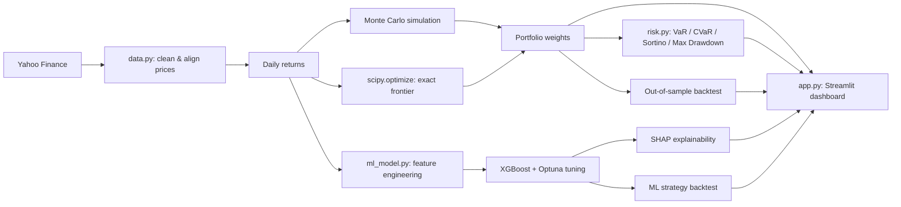

# Investment Portfolio

[](https://github.com/WObszan/Investment_Portfolio/stargazers)
[](https://www.python.org/)
[](https://investmentportfolio-wo.streamlit.app)
[](https://github.com/WObszan/Investment_Portfolio/actions/workflows/tests.yml)

Portfolio construction, risk analysis, and price-direction forecasting for equity portfolios.

**🔗 Live demo:** https://investmentportfolio-wo.streamlit.app

## Project goal

Investment Wallet turns raw price data into an optimized, risk-audited portfolio in one
pipeline. It combines classical Modern Portfolio Theory (Monte Carlo + exact `scipy`
optimization) with a supervised ML model (XGBoost + SHAP) that predicts short-term price
direction — both evaluated strictly out-of-sample.

## Architecture



## Setup

```bash
cd portfolio-dashboard
uv venv && uv pip install -r requirements.txt
```

> `pandas_ta` is unpinned — if the install fails, this is the package to check first.

## Common commands

```bash
streamlit run app.py
pytest -v
```

## What it does

- **Data** — downloads and cleans multi-ticker price history (`yfinance`), with per-ticker
  validity checks and gap handling.
- **Portfolio optimization** — Monte Carlo simulation (10k+ portfolios) *and* an exact
  efficient frontier via `scipy.optimize` (SLSQP), including dedicated Max Sharpe / Min
  Variance solvers.
- **Risk metrics** — VaR, CVaR, Sortino Ratio, Max Drawdown, Calmar Ratio.
- **Market risk** — CAPM regression (alpha/beta) and rolling beta over time.
- **Clustering** — K-Means grouping of assets by risk/return profile.
- **Backtesting** — chronological train/test split; portfolio weights are frozen on
  training data and evaluated on unseen data against an equal-weight portfolio and a
  benchmark.
- **DCA projection** — expected/optimistic/pessimistic portfolio growth under periodic
  contributions, with capped return assumptions to avoid extrapolating short-term rallies.
- **ML price-direction model** — XGBoost classifier on technical features (RSI, MACD,
  volatility, relative strength vs. benchmark, volume), tuned with Optuna on a held-out
  validation split, explained with SHAP, and backtested on a forward-return basis.


## Continuous Integration (CI)

This repository includes an automated GitHub Actions workflow (.github/workflows/tests.yml). On every push or pull_request to the main branch, the pipeline automatically:
- Sets up a clean Python 3.12 environment on ubuntu-latest.
- Installs uv and project dependencies.
- Executes the full test suite via pytest.

## Key results

Run configuration: 
- tickers `AAPL (Apple Inc.), BA (Boeing Company), BLK (BlackRock Inc.), GOOGL (Alphabet Inc.), ^GSPC (S&P 500 Index), JPM (JPMorgan Chase & Co.), PLTR (Palantir Technologies),
TMO (Thermo Fisher Scientific), UPS (United Parcel Service)`,
-  period 2015-01-01 – present, 75/25 train/test split.

**Portfolio optimization (Monte Carlo vs. exact scipy frontier)**
- Max Sharpe portfolio: 24.71% annual return, Sharpe ratio 0.99
- Min Risk portfolio: 18.72% annual risk
- The Monte Carlo cloud converges to the exact `scipy`-derived efficient frontier (visually confirmed).

**Risk**
- Max Sharpe portfolio: 95% VaR 1.97%, 95% CVaR 3.00%, Max Drawdown -33.44%
- Min Risk portfolio: Max Drawdown -30.51% — 2.93 percentage points shallower than Max Sharpe,
  at the cost of a lower Sortino (0.94 vs 1.49) and Calmar ratio (0.52 vs 0.74).

**Out-of-sample backtest**
| Strategy | Annual Return | Annual Risk | Sharpe |
|---|---|---|---|
| Max Sharpe (frozen weights) | 28.28% | 20.41% | 1.20 |
| Equal Weight | 29.74% | 19.33% | 1.35 |
| Benchmark (^GSPC) | 21.15% | 15.12% | 1.15 |

The optimized portfolio beat the S&P 500 benchmark but underperformed the naive
equal-weight baseline on unseen data — a well-documented effect in the literature
(the "1/N puzzle", DeMiguel et al. 2009): Sharpe-optimized weights can overfit to
in-sample history, while equal weighting is a surprisingly hard baseline to beat
out-of-sample.

**Diversification**
- Lowest correlation pair: PLTR vs UPS (0.14) — supports including both for diversification.

**Market risk (CAPM)**
- AAPL: beta 1.185 vs ^GSPC (moderately more volatile than the market); daily alpha
  (0.00044) is too close to zero to be a reliable signal of outperformance.

**ML price-direction model**
- Out-of-sample accuracy: 55,03% (baseline: 50% for a coin-flip)
- ML strategy cumulative return vs. Buy & Hold over the test period: 61,62% vs 52.03%

## Project structure

```
portfolio-dashboard/
├── app.py            # Streamlit UI - no calculation logic
├── data.py            # data download, cleaning, train/test split
├── optimization.py    # Monte Carlo, scipy optimizer, DCA projection
├── risk.py             # VaR/CVaR, Sortino, Max Drawdown, CAPM, rolling beta
├── clustering.py       # K-Means asset grouping
├── ml_model.py         # feature engineering, XGBoost + Optuna + SHAP, ML backtest
├── callbacks.py        # ticker selection widget synchronization
├── viz.py              # Plotly chart builders
├── tests/               # pytest unit tests
└── requirements.txt
```

## Limitations

- Backtests assume no transaction costs, taxes, or slippage.
- No short selling; weights are bounded to `[0, 1]`.
- Out-of-sample results depend on the chosen train/test split date and are not
  guaranteed to hold on future data.
- The ML model predicts direction only, over a fixed 5-day horizon — not calibrated
  position sizing or risk-adjusted signal strength.
- Currency risk is not modeled for non-USD assets.
