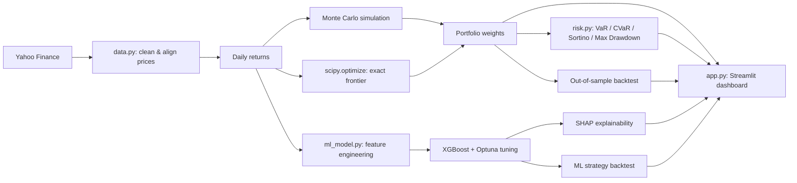

# Investment Portfolio

[](https://github.com/WObszan/Investment-Wallet/stargazers)
[](https://www.python.org/)
[](https://streamlit.io/)

Portfolio construction, risk analysis, and price-direction forecasting for equity portfolios.

## Project goal

Investment Wallet turns raw price data into an optimized, risk-audited portfolio in one
pipeline. It combines classical Modern Portfolio Theory (Monte Carlo + exact `scipy`
optimization) with a supervised ML model (XGBoost + SHAP) that predicts short-term price
direction — both evaluated strictly out-of-sample.

## Architecture



## Setup

```bash
cd portfolio-dashboard
uv venv && uv pip install -r requirements.txt
```

> `pandas_ta` is unpinned — if the install fails, this is the package to check first.

## Common commands

```bash
streamlit run app.py
pytest -v
```

## What it does

- **Data** — downloads and cleans multi-ticker price history (`yfinance`), with per-ticker
  validity checks and gap handling.
- **Portfolio optimization** — Monte Carlo simulation (10k+ portfolios) *and* an exact
  efficient frontier via `scipy.optimize` (SLSQP), including dedicated Max Sharpe / Min
  Variance solvers.
- **Risk metrics** — VaR, CVaR, Sortino Ratio, Max Drawdown, Calmar Ratio.
- **Market risk** — CAPM regression (alpha/beta) and rolling beta over time.
- **Clustering** — K-Means grouping of assets by risk/return profile.
- **Backtesting** — chronological train/test split; portfolio weights are frozen on
  training data and evaluated on unseen data against an equal-weight portfolio and a
  benchmark.
- **DCA projection** — expected/optimistic/pessimistic portfolio growth under periodic
  contributions, with capped return assumptions to avoid extrapolating short-term rallies.
- **ML price-direction model** — XGBoost classifier on technical features (RSI, MACD,
  volatility, relative strength vs. benchmark, volume), tuned with Optuna on a held-out
  validation split, explained with SHAP, and backtested on a forward-return basis.

## Project structure

```
portfolio-dashboard/
├── app.py            # Streamlit UI - no calculation logic
├── data.py            # data download, cleaning, train/test split
├── optimization.py    # Monte Carlo, scipy optimizer, DCA projection
├── risk.py             # VaR/CVaR, Sortino, Max Drawdown, CAPM, rolling beta
├── clustering.py       # K-Means asset grouping
├── ml_model.py         # feature engineering, XGBoost + Optuna + SHAP, ML backtest
├── callbacks.py        # ticker selection widget synchronization
├── viz.py              # Plotly chart builders
├── tests/               # pytest unit tests
└── requirements.txt
```

## Key results

> TODO — fill in with your own run's numbers before sharing this repo:
> - Max Sharpe vs. equal-weight vs. benchmark, out-of-sample (Sharpe, return, drawdown)
> - ML model out-of-sample accuracy and Strategy vs. Buy & Hold total return
> - Correlation highlights driving diversification benefits

## Limitations

- Backtests assume no transaction costs, taxes, or slippage.
- No short selling; weights are bounded to `[0, 1]`.
- Out-of-sample results depend on the chosen train/test split date and are not
  guaranteed to hold on future data.
- The ML model predicts direction only, over a fixed 5-day horizon — not calibrated
  position sizing or risk-adjusted signal strength.
- Currency risk is not modeled for non-USD assets.
